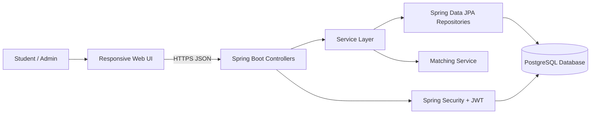
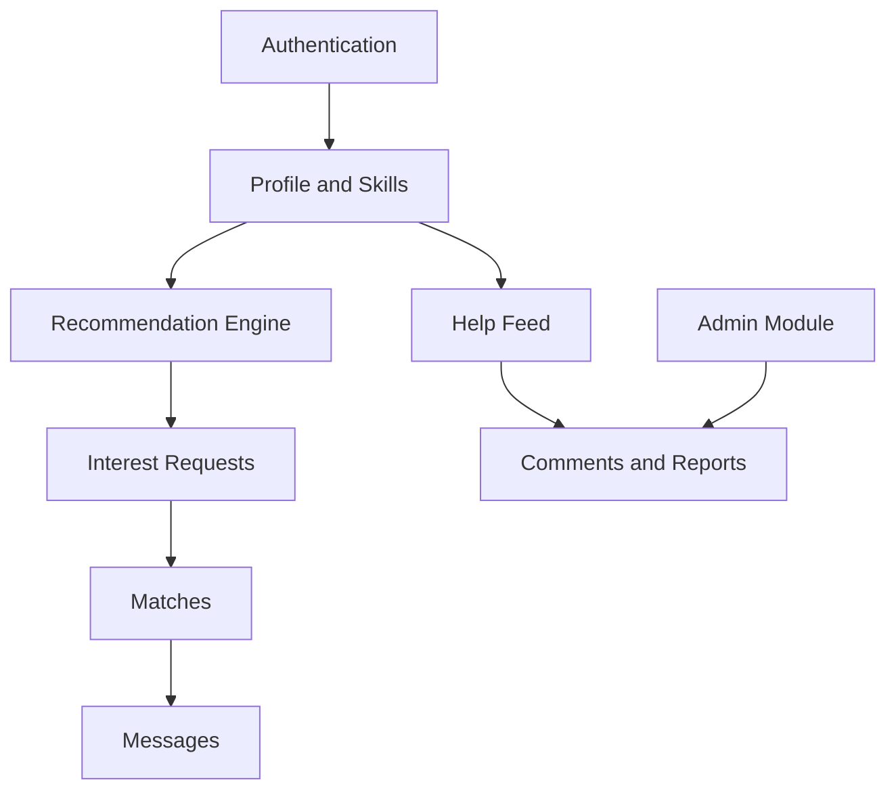
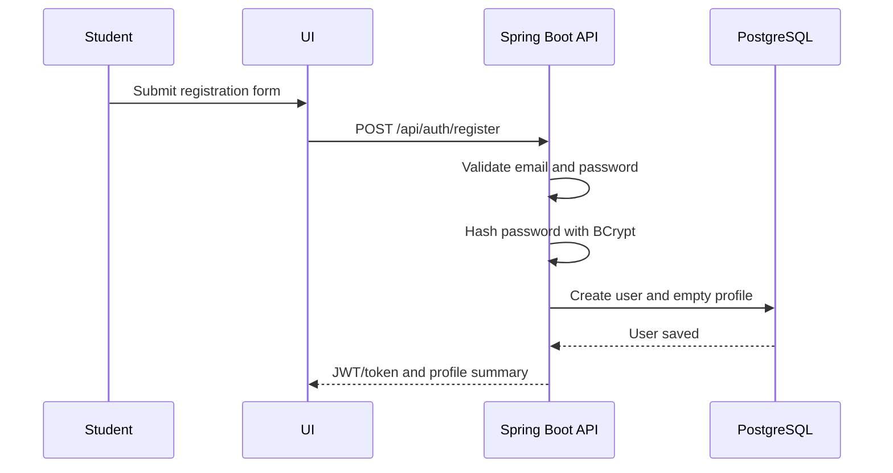
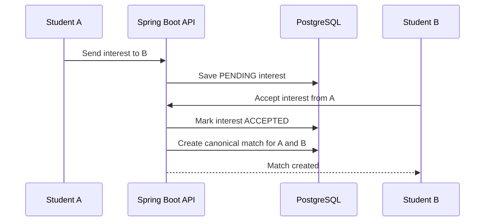

# Architecture and System Design

## 1. Current application analysis

The hackathon repository is a Flutter client application connected to Supabase. It has a FastAPI service for AI-related endpoints. The original system already contains profiles, a normalized skill catalogue, swipe records, matches, messages, collaboration records, feed posts, comments, reporting/blocking, portfolio evidence, skill XP and notifications. It also uses a complementarity ranking engine and an LLM to create project pitches after a match.

For the Java conversion, we will replace the direct Flutter-to-Supabase design with a clearer college-project structure: browser UI -> Spring Boot REST API -> PostgreSQL. This gives us a visible Java backend, database layer and API layer to explain in the mini-project evaluation.

## 2. Proposed architecture



The frontend can be made with React, or with Thymeleaf templates if the faculty prefers a pure Java-rendered application. Our recommended choice is React because it makes the UI smoother, but the backend remains exactly the same in both cases.

## 3. Backend layer design

| Layer | Responsibility | Examples |
|---|---|---|
| Controller | Accept request, validate input, return HTTP response | `AuthController`, `MatchController` |
| Service | Business rules and transactions | `MatchService`, `RecommendationService` |
| Repository | Database queries through JPA | `UserRepository`, `MessageRepository` |
| Entity | Database mapping | `User`, `Skill`, `Match`, `Message` |
| DTO | Request and response data | `RegisterRequest`, `RecommendationResponse` |
| Security | Login authentication and permission checks | JWT filter, role checks |

This separation is important: controllers should not directly write database logic, and entities should not be returned directly to the browser.

## 4. Main modules



## 5. Recommendation model

The original hackathon application used embeddings, swipe behaviour and LLM-generated project pitches. That is interesting but too large for the first Java submission. Our mini-project version uses skill levels and categories, which are easier to test and explain.

For a logged-in user `U` and candidate `C`:

```text
complementScore = skills strong in C but missing/weak in U
sharedScore     = skills present in both U and C
levelScore      = average proficiency of complementary skills
finalScore      = 0.60 * complementScore
                + 0.25 * sharedScore
                + 0.15 * levelScore
```

The score is only calculated for eligible candidates. Eligibility rules are:

- candidate is not the logged-in user;
- candidate account is active;
- pair is not blocked in either direction;
- the logged-in user has not already sent/declined interest for that candidate;
- candidate has at least one complementary skill.

The result includes the best complementary skills, so the UI can show a human-friendly explanation. The weights are stored as constants initially and can later be moved to an admin configuration table.

## 6. Important workflows

### 6.1 Registration and profile creation



### 6.2 Mutual-interest match



The match creation must be transactional. A unique database constraint on the sorted user pair is the final protection against duplicate matches.

## 7. System design decisions

| Decision | Reason |
|---|---|
| REST API | Clear separation between frontend and Java backend; easy to test in Postman. |
| PostgreSQL | Strong relational support, constraints and free local use. |
| JPA/Hibernate | Reduces repetitive SQL while still allowing custom queries for recommendations. |
| JWT authentication | Suitable for a separate frontend and stateless API. |
| DTO validation | Prevents invalid input and avoids exposing password fields. |
| Database transactions | Needed when accepting interest and creating a match. |
| Basic explainable score | Better for a college demo than a black-box AI model. |

## 8. Non-functional system design

- Use pagination for feed posts, messages and recommendation results.
- Add indexes on username, email, skill relations, interest pair and match pair.
- Return standard error JSON from a global exception handler.
- Log errors server-side without returning internal details to users.
- Keep secrets in environment variables, never in Git.
- Use CORS only for the development frontend URL and production domain.

