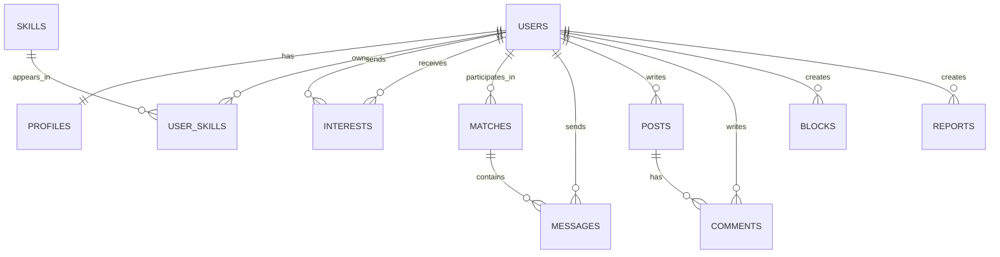

# Data Model and Database Design

## 1. Data model overview

The design is based on the useful core of the existing Mesh schema. The original app already uses the right main relationships: users have many skills, two users can form a match, a match has messages, and users can create feed posts and comments. The Java version simplifies the wider feature set while keeping these relationships normalized.



## 2. Core tables

| Table | Purpose |
|---|---|
| `users` | Login identity, role, password hash and account status |
| `profiles` | Student-facing details such as display name, department and bio |
| `skills` | Shared skill catalogue |
| `user_skills` | Many-to-many link between user and skill, with proficiency level |
| `interests` | One user's collaboration interest in another user |
| `matches` | Mutual collaboration connection between two users |
| `messages` | Messages belonging to a match |
| `posts` | Help requests or project/collaboration posts |
| `comments` | Replies to feed posts |
| `blocks` | User-to-user blocking relation |
| `reports` | Reports for moderation |

## 3. Relational schema

### users

| Column | Type | Rules |
|---|---|---|
| id | BIGINT | Primary key, generated identity |
| username | VARCHAR(50) | Unique, not null |
| email | VARCHAR(120) | Unique, not null |
| password_hash | VARCHAR(255) | Not null; BCrypt only |
| role | VARCHAR(20) | `STUDENT` or `ADMIN` |
| active | BOOLEAN | Default true |
| created_at | TIMESTAMP | Default current time |

### profiles

| Column | Type | Rules |
|---|---|---|
| user_id | BIGINT | Primary key and foreign key to users |
| display_name | VARCHAR(80) | Not null |
| department | VARCHAR(80) | Optional |
| year_of_study | INTEGER | Check 1 to 6 |
| bio | VARCHAR(500) | Optional |
| avatar_url | VARCHAR(255) | Optional in phase 2 |
| updated_at | TIMESTAMP | Updated on edit |

### skills and user_skills

| Table | Main columns | Rules |
|---|---|---|
| skills | id, name, category | Skill name is unique |
| user_skills | user_id, skill_id, level | Composite primary key; level check 1 to 5 |

### interests

| Column | Type | Rules |
|---|---|---|
| id | BIGINT | Primary key |
| sender_id | BIGINT | FK users, cannot equal receiver |
| receiver_id | BIGINT | FK users, cannot equal sender |
| status | VARCHAR(20) | `PENDING`, `ACCEPTED`, `DECLINED`, `CANCELLED` |
| created_at | TIMESTAMP | Default current time |

Unique constraint: `(sender_id, receiver_id)`. The application should not allow an interest if there is already a match.

### matches

| Column | Type | Rules |
|---|---|---|
| id | BIGINT | Primary key |
| user_one_id | BIGINT | FK users |
| user_two_id | BIGINT | FK users |
| created_at | TIMESTAMP | Default current time |

Before saving, the service always stores the smaller user ID as `user_one_id`. A unique constraint on `(user_one_id, user_two_id)` prevents duplicates.

### messages

| Column | Type | Rules |
|---|---|---|
| id | BIGINT | Primary key |
| match_id | BIGINT | FK matches |
| sender_id | BIGINT | FK users; must be match participant |
| content | VARCHAR(2000) | Not blank |
| sent_at | TIMESTAMP | Default current time |
| read_at | TIMESTAMP | Nullable |

### posts and comments

`posts` stores author, title, body, post type (`HELP` or `PROJECT`), category, status and timestamps. `comments` stores post, author, body and timestamps. `posts.solved_comment_id` is nullable and points to the comment selected by the author.

## 4. Data integrity rules

- A profile is created once for every user account.
- A user cannot add the same skill twice.
- Proficiency is an integer between 1 and 5.
- A user cannot send an interest request to self.
- A match has exactly two distinct users.
- Only a match participant can read or send messages in that match.
- Only the post author can mark a comment as solved.
- A blocked user must be excluded from recommendations, requests and messages.

## 5. Suggested indexes

```text
users(email), users(username)
user_skills(skill_id, user_id)
interests(sender_id, receiver_id)
matches(user_one_id, user_two_id)
messages(match_id, sent_at)
posts(created_at), comments(post_id, created_at)
```

## 6. Seed data

For the demonstration, seed 15-20 students across development, UI/UX, content, hardware and management categories. Every student should have at least three skills. This makes recommendations visually meaningful in the demo without using real student data.

## 7. Difference from the hackathon database

The original Supabase design also has skill XP, portfolio proof, social-account integrations, credit economy, device tokens, AI moderation and behavioural signals. Those tables are not needed for the basic Java mini project. Keeping the database smaller will make our ER diagram, implementation and testing more manageable.

